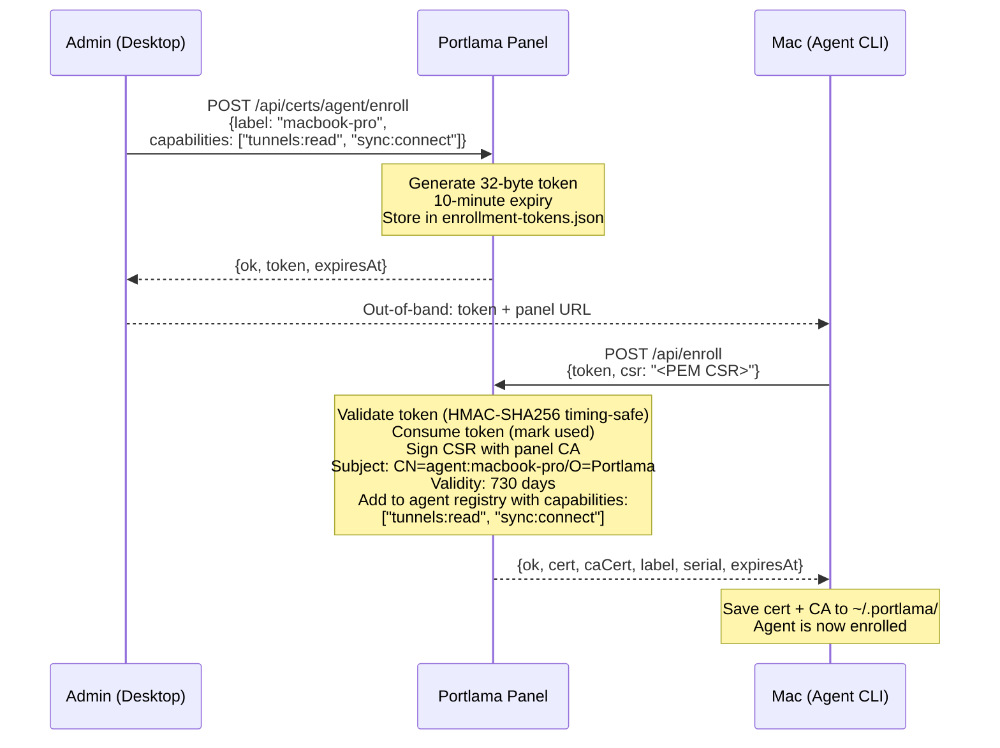
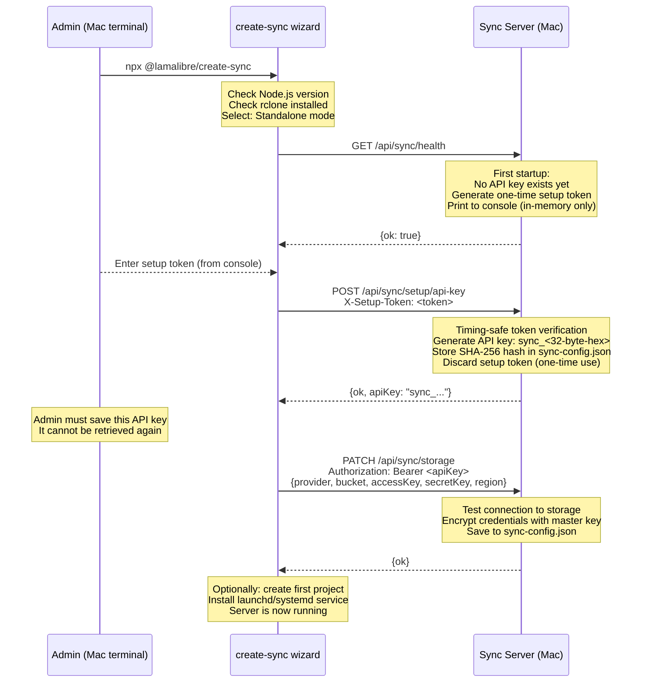
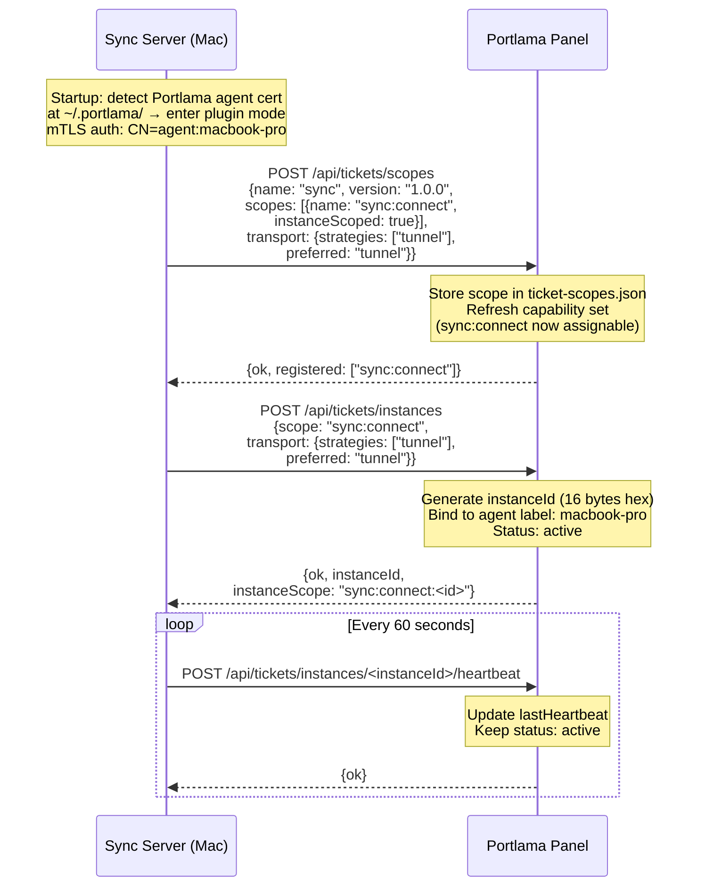
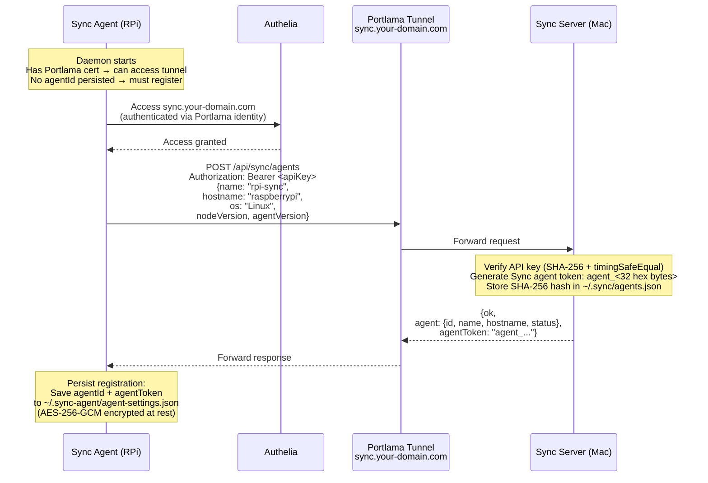
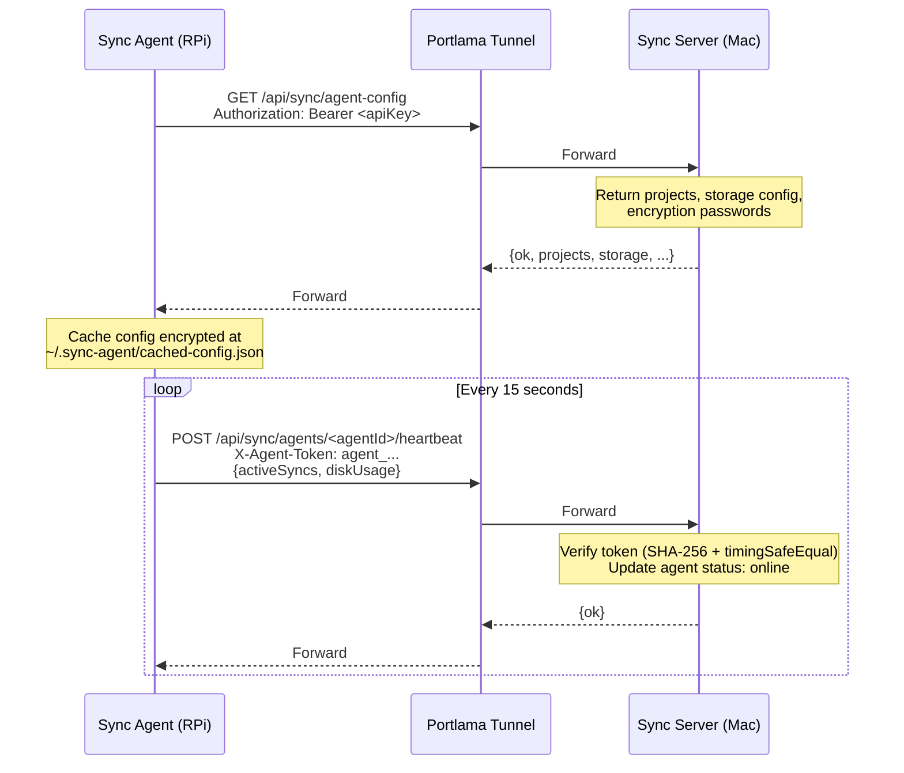
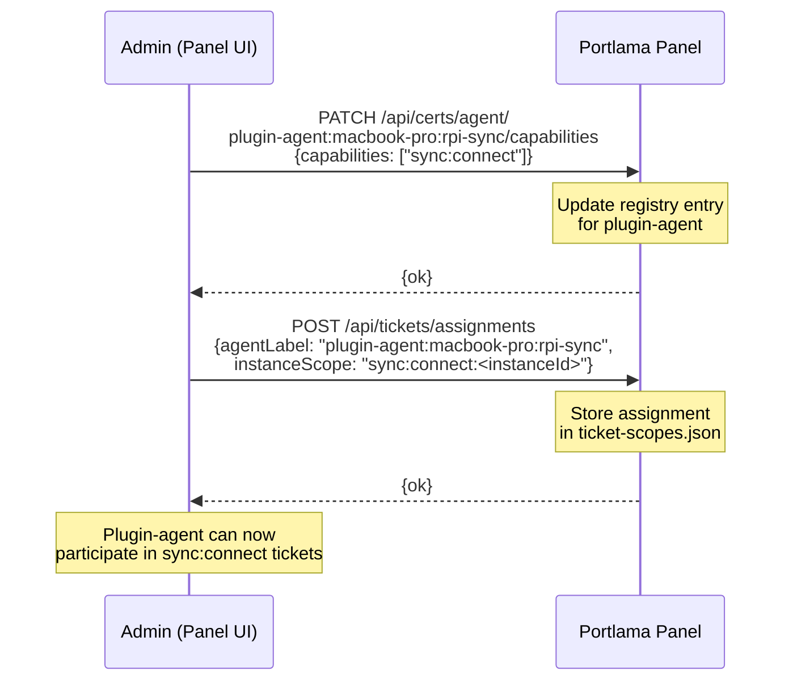

# Standalone Plugin with Portlama Tickets

> This guide walks through deploying a plugin (e.g., Sync) as a standalone server that uses Portlama's tunneling and ticket system for authorization — without running the plugin as a Portlama panel plugin.

## Scenario

You are an admin who has:

1. A **Portlama server** running on a DigitalOcean droplet
2. A **Mac** with a Portlama agent enrolled and a standalone Sync server installed
3. A **Raspberry Pi** running a Sync agent that needs to sync files with the Sync server

The Sync server is **not** a Portlama plugin — it runs as its own process on its own port. However, it leverages Portlama for:

- **Tunneling** — making the Sync server reachable through a Portlama subdomain
- **Tickets** — authorizing which agents can connect to the Sync server

## Step-by-Step Walkthrough

### 1. Install the Portlama Desktop App

The desktop app is a management shell for existing CLI tools — it does not install them. If the Portlama agent CLI or Sync CLI are not already installed, install them first.

### 2. Provision a Portlama Server

Using the desktop app's cloud provisioning wizard:

- Enter your DigitalOcean API token
- Select a region and droplet size
- The wizard calls `@lamalibre/portlama-cloud` to create the droplet
- Progress streams back as NDJSON events in the desktop UI
- Complete onboarding in the browser panel

### 3. Enroll a Portlama Agent on the Mac

From the Portlama panel, create an enrollment token with the `sync:connect` capability (in addition to the default `tunnels:read`). On the Mac, run `portlama-agent setup` with that token.



### 4. Install the Sync Server Standalone on the Mac

Run the Sync installer on the Mac:

```
npx @lamalibre/create-sync
```

The installer walks through an interactive setup wizard. On first run, the Sync server generates a one-time **setup token** (printed to console, never persisted). The admin enters this token to generate an **API key** that secures all subsequent API access.



The Sync server now runs as a local service on the Mac. It operates independently of Portlama — it has its own API key, its own storage config, and its own agent registry at `~/.sync/agents.json`.

### 5. Register Sync Scopes and Instance on Portlama

The Sync server detects that the Mac has a Portlama agent certificate. Using that cert (mTLS), it registers a ticket scope and instance with the Portlama panel. This is handled automatically by `TicketInstanceManager` from `@lamalibre/portlama-tickets` — the admin does not need to do anything.



### 6. Create a Tunnel for the Sync Server

The admin creates a tunnel through Portlama so the Sync server is reachable from the internet at a subdomain (e.g., `sync.your-domain.com`). The tunnel forwards traffic from the Portlama droplet through the Mac's Portlama agent to the local Sync server port. All Portlama tunnel subdomains are protected by Authelia — unauthenticated requests are redirected to the login portal.

### 7. Admin Prepares Agent Enrollment

Before the Raspberry Pi can connect, the admin must prepare its enrollment. This is a two-part process: the admin creates the enrollment on the Sync server, and the Sync server pre-announces it to the Portlama panel.

The admin creates a new agent enrollment on the Sync server (e.g., via the Sync CLI or admin API). Because the Sync server detects it is running as a Portlama agent, it automatically pre-announces to the Portlama panel, requesting a delegated enrollment token for the new agent.

```mermaid
sequenceDiagram
    participant Admin as Admin (Mac)
    participant Sync as Sync Server (Mac)
    participant Panel as Portlama Panel

    Admin->>Sync: Create enrollment for agent "rpi-sync"<br/>Authorization: Bearer <apiKey>

    Note over Sync: Detect: has Portlama agent cert<br/>→ pre-announce to Portlama

    rect rgb(40, 40, 60)
        Note over Sync,Panel: Pre-announcement (mTLS: CN=agent:macbook-pro)
        Sync->>Panel: POST /api/certs/agent/enroll-delegated<br/>{pluginAgentLabel: "rpi-sync",<br/>scope: "sync:connect"}
        Note over Panel: Verify caller is agent (not plugin-agent)<br/>Verify sync:connect is a registered ticket scope<br/>Verify sync:connect is NOT a base capability<br/>Verify agent owns active instance for scope<br/>Generate delegated token (32 bytes, 10-min expiry)<br/>Store with type: "delegated",<br/>delegatedBy: "macbook-pro",<br/>label: "plugin-agent:macbook-pro:rpi-sync",<br/>capabilities: ["sync:connect"]
        Panel-->>Sync: {ok, enrollmentToken,<br/>expiresAt, pluginAgentLabel}
    end

    Sync-->>Admin: Enrollment prepared:<br/>- Sync API key (already known)<br/>- Sync server URL: sync.your-domain.com<br/>- Portlama delegated token<br/>- Portlama panel URL

    Note over Admin: Admin now has everything needed<br/>to set up the Raspberry Pi
```



The admin now has four pieces of information to give to the Raspberry Pi:

| Credential | Purpose | Source |
|-----------|---------|--------|
| Sync API key | Authenticate with the Sync server | From step 4 (already known) |
| Sync server URL | Where to reach the Sync server | `https://sync.your-domain.com` (the tunnel) |
| Portlama delegated token | Enroll with Portlama to get a certificate | From the pre-announcement (one-time, 10-min expiry) |
| Portlama panel URL | Where to submit the enrollment | `https://your-domain.com` |

### 8. Raspberry Pi Enrolls with Portlama

The Raspberry Pi must enroll with Portlama **before** it can access the tunnel. The Portlama panel's `/api/enroll` endpoint is public — no mTLS or Authelia required. The delegated token is the sole authentication gate.

```mermaid
sequenceDiagram
    participant Admin as Admin
    participant RPi as Raspberry Pi
    participant Panel as Portlama Panel

    Admin-->>RPi: Out-of-band: delegated token +<br/>panel URL + API key + tunnel URL

    Note over RPi: Step 1: Enroll with Portlama FIRST<br/>(before accessing the tunnel)<br/>Generate RSA 4096-bit keypair<br/>Create CSR via openssl req

    rect rgb(40, 60, 40)
        Note over RPi,Panel: Portlama enrollment (public endpoint — no mTLS, no Authelia)
        RPi->>Panel: POST /api/enroll<br/>{token: delegatedToken,<br/>csr: "<PEM CSR>"}
        Note over Panel: Validate token (HMAC-SHA256 timing-safe)<br/>Verify delegating agent (macbook-pro)<br/>still registered and not revoked<br/>Consume token (mark used)<br/>Sign CSR with panel CA<br/>Subject: CN=plugin-agent:macbook-pro:rpi-sync<br/>Validity: 730 days<br/>Add to agent registry:<br/>enrollmentMethod: "delegated"<br/>delegatedBy: "macbook-pro"<br/>capabilities: ["sync:connect"]
        Panel-->>RPi: {ok, cert, caCert,<br/>label: "plugin-agent:macbook-pro:rpi-sync",<br/>serial, expiresAt}
    end

    Note over RPi: Save Portlama cert files to<br/>~/.sync-agent/portlama-cert/<br/>client.key (mode 0600)<br/>client.crt (mode 0644)<br/>ca.crt (mode 0644)

    Note over RPi: RPi now has a Portlama identity<br/>and can access Authelia-protected tunnels
```



### 9. Raspberry Pi Registers with the Sync Server

Now that the RPi has a Portlama certificate, Authelia can identify it and grant access to the tunnel subdomain. The RPi connects to `sync.your-domain.com` through the Authelia-protected tunnel and registers with the Sync server using the API key.



After registration, the Sync agent starts its normal operation — fetching config, heartbeating, and syncing files:



The Sync agent now has three credentials:

| Credential | Purpose | Stored at |
|-----------|---------|-----------|
| Portlama plugin-agent cert (`CN=plugin-agent:macbook-pro:rpi-sync`) | Authenticate with Authelia to access the tunnel; participate in the Portlama ticket system | `~/.sync-agent/portlama-cert/` (PEM files) |
| Sync API key (`Authorization: Bearer`) | Authenticate with the Sync server for config fetch and registration | `~/.sync-agent/agent-settings.json` (AES-256-GCM encrypted) |
| Sync agent token (`X-Agent-Token`) | Authenticate with the Sync server for heartbeats and sync reports | `~/.sync-agent/agent-settings.json` (AES-256-GCM encrypted) |

### 10. Admin Grants Ticket Access

The delegated enrollment gives the Sync agent a Portlama identity, but it still needs to be authorized in the ticket system. The admin assigns the `sync:connect` capability and creates a ticket assignment.



The plugin-agent cert starts with only the delegated scope capability (`sync:connect`). The admin can grant additional capabilities via the Certificates page if needed — this is a deliberate opt-in with minimal privilege as the default.

### 11. Ticket Authorization in Action

With both agents enrolled and the assignment in place, the ticket system authorizes file sync sessions. The Mac (source, instance owner) requests a ticket targeting the RPi's plugin-agent. The RPi polls its inbox, validates the ticket, and establishes a session with heartbeat-based re-validation.

```mermaid
sequenceDiagram
    participant Mac as Sync Server (Mac)<br/>SOURCE: owns instance
    participant Panel as Portlama Panel
    participant RPi as Sync Agent (RPi)<br/>TARGET: assigned to instance

    Mac->>Panel: POST /api/tickets<br/>(mTLS: CN=agent:macbook-pro)<br/>{scope: "sync:connect",<br/>instanceId: "<id>",<br/>target: "plugin-agent:<br/>macbook-pro:rpi-sync"}
    Note over Panel: Rate limit (max 10/min per agent)<br/>Verify source exists, not revoked<br/>Verify source has sync:connect<br/>Verify target exists, not revoked<br/>Verify target has sync:connect<br/>Verify source owns instance (not stale)<br/>Verify source ≠ target<br/>Verify target assigned to instance<br/>Generate ticket (32 bytes, 30-sec TTL)
    Panel-->>Mac: {ok, ticket: {id, scope,<br/>instanceId, source, target, expiresAt}}

    RPi->>Panel: GET /api/tickets/inbox<br/>(mTLS: CN=plugin-agent:<br/>macbook-pro:rpi-sync)
    Panel-->>RPi: {tickets: [{id, scope,<br/>source, expiresAt}]}

    RPi->>Panel: POST /api/tickets/validate<br/>{ticketId: "<id>"}
    Note over Panel: HMAC-SHA256 timing-safe compare<br/>Verify not expired (30-sec TTL)<br/>Verify not already used<br/>Verify caller is target<br/>Mark ticket as used
    Panel-->>RPi: {valid: true, scope,<br/>instanceId, source, target, transport}

    RPi->>Panel: POST /api/tickets/sessions<br/>{ticketId: "<id>"}
    Note over Panel: Generate sessionId<br/>(16 bytes, server-side)<br/>Status: active
    Panel-->>RPi: {ok, session: {sessionId,<br/>scope, source, target,<br/>status: "active"}}

    loop Every 60 seconds
        RPi->>Panel: POST /api/tickets/sessions/<sessionId>/heartbeat
        Note over Panel: Re-validate:<br/>Source not revoked?<br/>Source has capability?<br/>Target not revoked?<br/>Target has capability?<br/>Assignment still valid?
        Panel-->>RPi: {authorized: true}
    end

    Mac<-->RPi: Sync session authorized — file sync proceeds
```

### Revocation Cascade

If the admin revokes the Mac's Portlama agent cert (`CN=agent:macbook-pro`), the panel automatically cascade-revokes all plugin-agents delegated by that agent. The Sync agent's cert is revoked in the same atomic operation, and the next session heartbeat terminates the active sync session.

```mermaid
sequenceDiagram
    participant Admin
    participant Panel as Portlama Panel
    participant RPi as Sync Agent (RPi)

    Admin->>Panel: DELETE /api/certs/agent/macbook-pro

    Note over Panel: Revoke agent:macbook-pro<br/>Add serial to revoked.json

    rect rgb(80, 40, 40)
        Note over Panel: Cascade revocation
        Note over Panel: Find all plugin-agents where<br/>delegatedBy = "macbook-pro"<br/>→ plugin-agent:macbook-pro:rpi-sync
        Note over Panel: Revoke each plugin-agent<br/>Add their serials to revoked.json<br/>Clean up cert files
    end

    Note over Panel: Save registry atomically
    Panel-->>Admin: {ok}

    Note over RPi: Next heartbeat...
    RPi->>Panel: POST /api/tickets/sessions/<sessionId>/heartbeat
    Note over Panel: Target cert is revoked
    Panel-->>RPi: {authorized: false,<br/>reason: "target_revoked"}
    Note over RPi: Session terminated<br/>Active syncs cancelled
```



### Standalone vs Tunneled Behavior

The delegated enrollment flow depends on whether the Sync server is reachable through a Portlama tunnel or directly by IP:

| Access method | Portlama cert? | Ticket authorization |
|---------------|----------------|---------------------|
| Direct IP (`192.168.1.x:port`) | No — no Portlama involvement | Sync server mediates tickets on behalf of its agents using its own cert. Two-party model collapses to single party. Sufficient for trusted local networks. |
| Portlama tunnel (`sync.your-domain.com`) | Yes — delegated enrollment | Each Sync agent has its own Portlama identity (`CN=plugin-agent:...`). Full two-party ticket authorization with independent source and target identities. |

When the Sync server detects it has a Portlama agent cert, the admin can prepare agent enrollments that include delegated Portlama tokens. When running standalone without a Portlama agent, only the Sync API key is needed and ticket authorization is self-mediated.

```mermaid
flowchart TD
    A[Admin prepares<br/>new agent enrollment<br/>on Sync Server] --> B{Sync Server has<br/>Portlama agent cert?}

    B -->|Yes| C[Tunneled Mode]
    B -->|No| D[Standalone Mode]

    C --> C1[1. Pre-announce to Portlama panel<br/>POST /api/certs/agent/enroll-delegated]
    C1 --> C2[2. Admin gives RPi: API key +<br/>tunnel URL + delegated token + panel URL]
    C2 --> C3[3. RPi enrolls with Portlama FIRST<br/>POST /api/enroll — public endpoint]
    C3 --> C4[4. RPi has Portlama cert<br/>→ can access Authelia-protected tunnel]
    C4 --> C5[5. RPi registers with Sync server<br/>through the tunnel]
    C5 --> C6[Full two-party<br/>ticket authorization]

    D --> D1[1. Admin gives RPi:<br/>API key + server IP/URL]
    D1 --> D2[2. RPi registers with Sync server<br/>directly via IP]
    D2 --> D3[No Portlama identity]
    D3 --> D4[Sync server self-mediates<br/>tickets using its own cert]

    style C fill:#1a3a2a,stroke:#4ade80
    style D fill:#3a2a1a,stroke:#fbbf24
    style C6 fill:#1a3a2a,stroke:#4ade80
    style D4 fill:#3a2a1a,stroke:#fbbf24
```



## Related Documentation

- [Tickets (Agent-to-Agent)](../01-concepts/tickets.md) — ticket system concepts and data model
- [mTLS & Client Certificates](../01-concepts/mtls.md) — certificate scoping and capabilities
- [Certificate Management](certificate-management.md) — managing agent certificates
